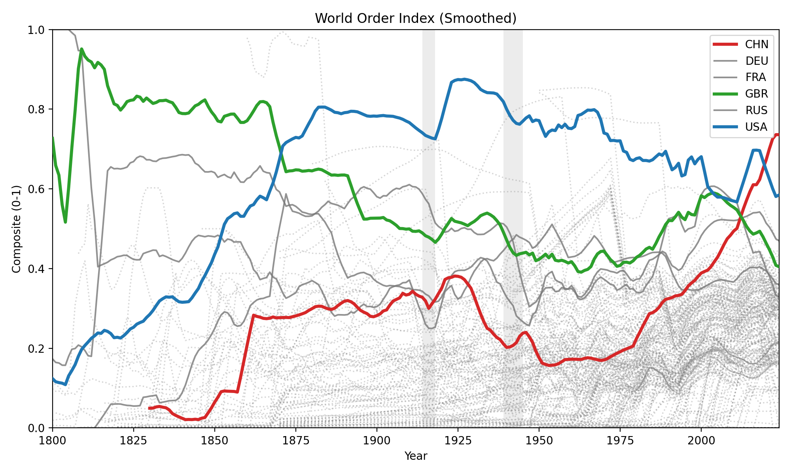
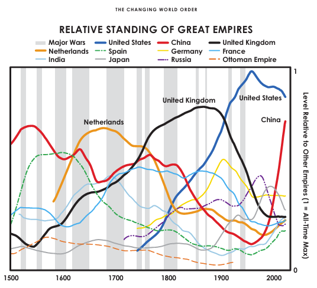

# Deep Learning to predict the future

## Project under construction....
This repository explores whether nations and corporations follow similar rise-and-fall dynamics, and whether machine learning can project these trajectories into the future. By combining public socio-economic datasets with deep learning architectures, the project attempts to generate ten-year forecasts of both empires (countries) and companies (industries).

At the core is a simple but provocative research question:
### Are Empires and Companies one in the same?

To test this, I divide the data into two domains:

- Empires (Countries): measured across eight structural dimensions such as debt, military strength, education, innovation, and reserve currency status.
- Companies (Industries): measured across parallel dimensions such as market capitalization, R&D spending, revenue growth, employment share, and global market share.

Additional constants are layered into the models to account for corruption (data trustworthiness) and geography (structural advantages or constraints like natural resources, trade access, and climate). These are treated not as predictors of year-to-year variance, but as underlying priors that shape long-term trajectories.

From this foundation, I train three experimental models:

1) World Order Forecast (WOF): projecting the relative standing of nations.
2) Market Share Forecast (MSF): projecting industry and corporate dominance.
3) MSF Diluted from WOF: combining the two perspectives to test whether national and corporate cycles reinforce or diverge from one another.

### Validation Philosophy

To measure accuracy, the models use a leave-one-out cross-validation strategy: excluding one country or industry from training, then testing predictions against its historical trajectory. Instead of cherry-picking predictable cases (which would inflate accuracy), the focus is on average predictability—candidates with moderate volatility and representative dynamics.

Still, all forecasts remain provisional. Global events are interdependent, and any model trained on past data necessarily inherits both its scope and its blind spots. This highlights a larger truth:
***predictive models can never know the future, but they can help uncover the structures and cycles that shape it.***

## Background

I was first introduced to this idea reading Ray Dalio's compelling piece, [Principles for dealing with the changing world order](https://www.economicprinciples.org/DalioChangingWorldOrderCharts.pdf). 

His team assembled data that dates back nearly 1000 years from hundred of cross referenced sources. My first instinct was to reproduce his graphs, but much of his data was privatized and internal. Therefore, the primary limitation with my project-as with any deep learning pursuit-is data. I could only pull from a few publically available sources within the scope of my resources.

# Reconstruction of Ray's Graph Progress
## Need to pull from more sources to get a bigger picture

## Ray's Graph

## Training Data

- Located in build_world_order/results/metrics.csv
    -   [country_name,ISO3,year,EDU,MIL,ECON,TRAD,RESV,FIN,INV,CMPT,INDEX,geography_index]
- Each Country ranges between 1800 - 2024
- It will be Trained when there are atleast 4 available metrics
    - Further explanation of assembley in the folder's readme
    - Each country-year includes a geography index, which scores optimism;
        - Expected Future Growth=f(Xt​)+β⋅geography 
# Training

- If a country has < 100 years of valid data, exclude.
    - Also exclude the validation candidate, currently denmark
- rolling windows of length=50 (past) → forecast horizon=30 (future).
- Use the last known geography_index in the input window
    - Add β·geography as an additive bias to the output head
- Temporal ConvNet (1D Conv over time) on the K channels.
- Output a 30-step forecast for each target metric
- Build a boolean mask (K,50) for inputs; use masked loss.
- Only generate loss on targets actually present in the 30y horizon.

## Validation Strategy & Exclusions

- Current candidate to exclude: denmark
    - relatively stable, not too stable. 
