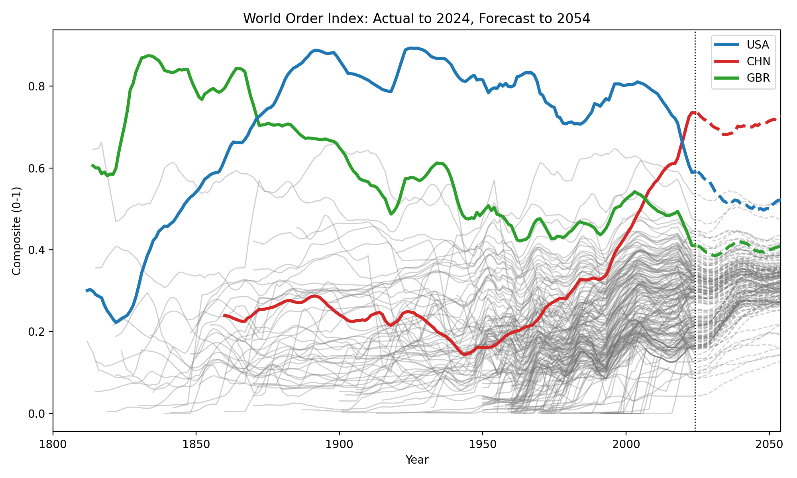
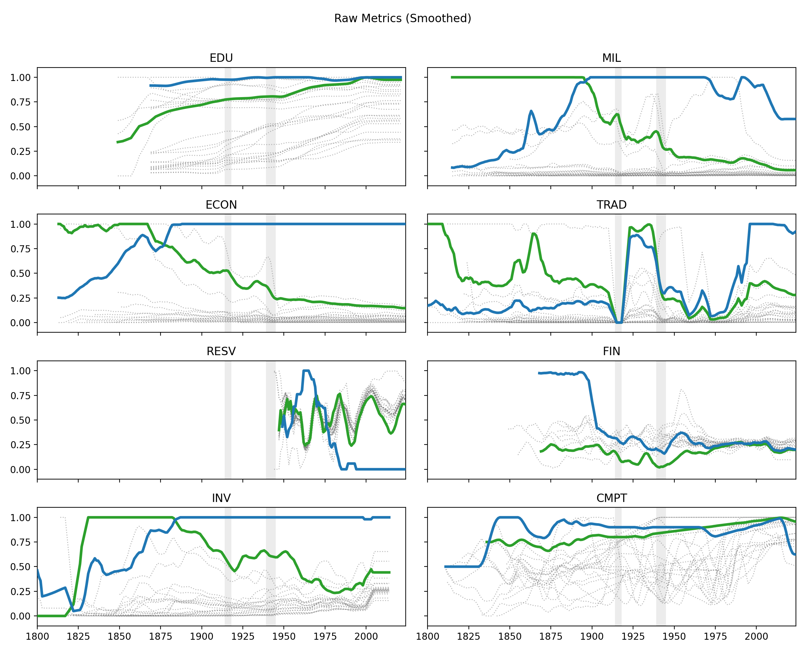
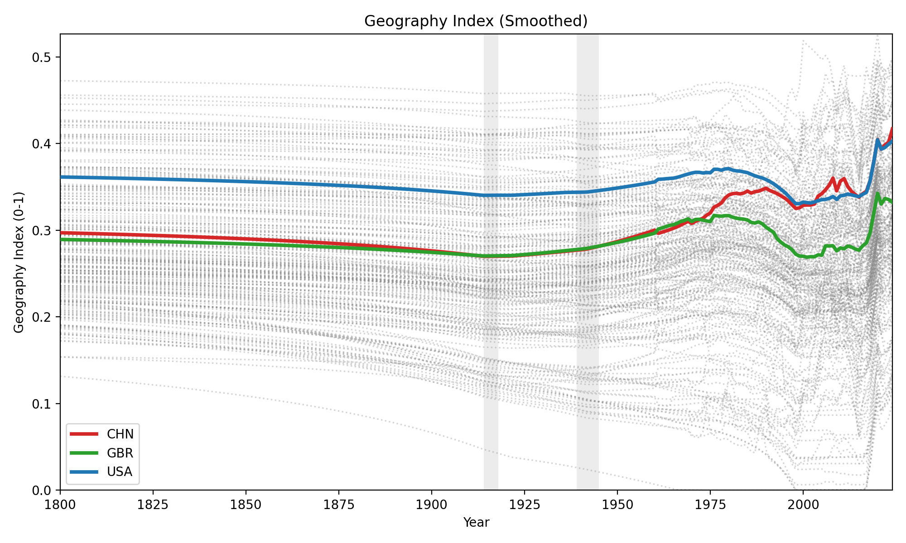
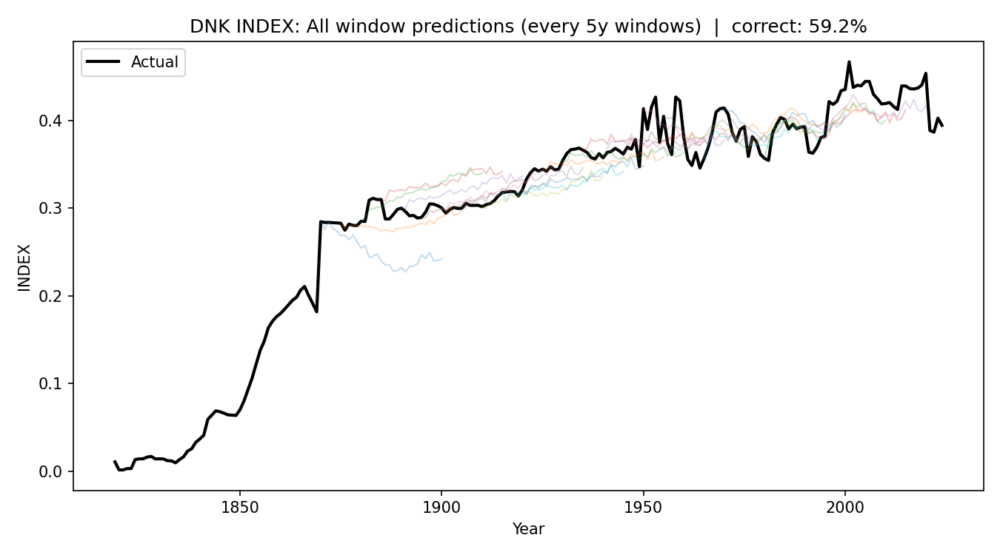

# Can I use Deep Learning to model political trends?

## Contents
* [Results](#results)
* [Conclusion](#conclusion)
* [Background](#background)
* [Data Coverage](#data-coverage)
* [Data Source (excluded from github)](#data-source-excluded-from-github)
* [Metrics Calculation](#metrics-calculation)
* [Training](#training)
* [Validation](#validation)

## Results
### A country's composite score is the weighted average of Ray Dalio's 8 metrics for empire strength (implementation details below)

## Conclusion

While it is conceptually possible to apply deep learning to forecast world orders, the scope of data required to capture the cyclical nature of global politics exceeds the resources available for this independent study. Meaningful temporal windows would need to span approximately 250 years per empire, yet most countries only provide about 150 years of reliable data. The model’s 60% accuracy suggests that some predictive signal exists, but overall performance represents only a modest 10% improvement over random chance and aligns closely with results produced by a 50-year windowed linear regression approach. More traditional frameworks, such as statistical arbitrage, may therefore prove more suitable for this kind of analysis.

Nevertheless, as I continue my research, I hypothesize that the greater availability of data within the American stock market—and the shorter life cycles of individual companies—will allow for more precise modeling of economic trajectories on a monthly scale. This insight motivates the next phase of my work: developing a data-driven trading tool capable of forecasting corporate performance trends with higher temporal accuracy.

## Background

I was first introduced to this idea reading Ray Dalio's compelling piece, [Principles for dealing with the changing world order](https://www.economicprinciples.org/DalioChangingWorldOrderCharts.pdf). 

I sought to reproduce his team's graphs through the same kind of metric weighting. His Data went much further back in time and was more streamlined. Unfortunately, they used privatized/internal sources and methods. 

# Data coverage

- Further explanation of assembley in the folder's readme
- Notice lack of financial / Currency data (mostly privatized)

# Data Source (excluded from github)
| **Public Source**                                                                                            | **Purpose**                                                            | **Key Columns Used**                                                                         |
| ------------------------------------------------------------------------------------------------------------ | ---------------------------------------------------------------------- | -------------------------------------------------------------------------------------------- |
| [**Global Macro Database (GMD)**](https://github.com/KMueller-Lab/Global-Macro-Database/blob/main/README.md) | Core macroeconomic data including GDP, trade, and monetary aggregates. | `rGDP_USD`, `USDfx`, `cGovDebtGDP`, `exports_USD`, `imports_USD`, `M0`, `finv_GDP`, `CA_USD` |
| **Education Data (World Bank / Barro-Lee)**                                                                  | Measures average years of schooling as a proxy for human capital.      | `Years_School`, `CCODE`, `Year`                                                              |
| **Military Spending (SIPRI / World Bank)**                                                                   | Captures national defense expenditure as share of GDP or total output. | `Military_Spending`, `CCODE`, `Year`                                                         |
| **Polity IV Dataset (Center for Systemic Peace)**                                                            | Provides indicators of governance quality and political structure.     | `xconst`, `parcomp`, `CCODE`, `Year`                                                         |
| [**Comin & Hobijn CHAT Dataset**](https://dcomin.host.dartmouth.edu/indexdatasets.php)                       | Tracks technological adoption across 1800–2000 by sector and country.  | Various technology diffusion variables (`telephones`, `electricity`, `internet`, etc.)       |
| **Geography & Land Use (World Bank / FAO)**                                                                  | Provides area-based indicators for agriculture, forest, and land mass. | `Ag_land`, `Forest_Area`, `Land_Area`, `Country_Code`, `Year`                                |

# Metrics Calculation

| **Metric**                  | **Formula**                                                                                 | **Data Sources Used** | **Notes / Normalization**                             |
| --------------------------- | ------------------------------------------------------------------------------------------- | --------------------- | ----------------------------------------------------- |
| **Education (EDU)**         | `norm(education)`                                                                           | `Education.csv`       | Normalized education index per year                   |
| **Military (MIL)**          | `norm(CINC)`                                                                                | `military.csv`        | Composite Index of National Capability                |
| **Economic Output (ECON)**  | `norm(rGDP_USD)`                                                                            | `GMD.csv`             | GDP normalized by year across all countries           |
| **Trade Share (TRAD)**      | `avg(norm(exports_USD), norm(imports_USD))`                                                 | `GMD.csv`             | Measures global trade integration                     |
| **Reserve Currency (RESV)** | `norm(CA_USD)`                                                                              | `GMD.csv`             | Proxy for currency dominance and account balance      |
| **Financial Center (FIN)**  | `0.5*norm(M0) + 0.3*norm(finv_GDP) + 0.2*(1 − norm(cGovDebtGDP))`                           | `GMD.csv`             | Combines money supply, investment, and debt stability |
| **Innovation (INV)**        | `avg([norm(col) for col in CHAT.csv])`                                                      | `CHAT.csv`            | Mean of normalized AI/tech indicators                 |
| **Competitiveness (CMPT)**  | `avg(norm(xconst), norm(parcomp))`                                                          | `polity.csv`          | Reflects governance strength and political stability  |
| **Geography (GEOGRAPHY)**   | `avg(norm(Ag_land/Land_area), norm(Forest_area/Land_area), …)`                              | `/geography_data/`    | Backfilled to 1800–2024, linearly interpolated        |
| **Composite Index (INDEX)** | `0.15*EDU + 0.15*CMPT + 0.15*INV + 0.15*ECON + 0.10*TRAD + 0.10*MIL + 0.10*FIN + 0.10*RESV` | All of the above      | Weights renormalized when data missing                |

# Training

- Rolling windows of length=50 ( gaussian)
-  forecast horizon=30.
- Use the last known geography_index in the input window
    - Add β·geography as an additive bias to the output head
- Temporal ConvNet (1D Conv over time) on the K channels.
- Output a 30-step forecast for each target metric
- Build a boolean mask (K,50) for inputs; use masked loss.
- Only generate loss on targets actually present in the 30y horizon.

## Validation

- Walk forward, regression based evaluation
- Percent of deltas with correct sign at each year gives the final accuracy
